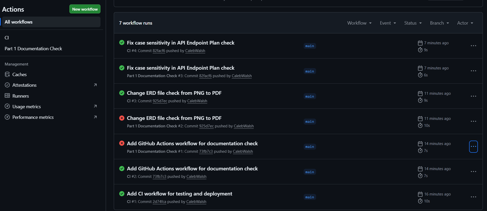

# RCNMBCampus-prog6212-part-1-CalebWalsh
# RaceDay Event Management System

## Project Description

RaceDay is a full-stack, web-based event management system built for the South African road running, walking, and cycling community. It replaces the paper-based registration, spreadsheets, and disconnected communication that currently plague community race events across the country.

Event Organisers can create and manage events, define categories, and capture participant results. Participants can browse upcoming events, enter events by selecting a category, track their own enrolments, and follow their personal performance history over time.

This is an individual project built progressively across three parts:
- **Part 1** (this submission): System planning — ERD, API endpoint plan, and SQL database script.
- **Part 2**: RESTful API built in C#, connected to the database, with unit tests and CI/CD.
- **Part 3**: MVC web application consuming the API, with Azure Blob Storage integration and Docker containerisation.
## User Roles

### Organiser
- Create, edit, and delete events.
- Manage event categories.
- View all enrolments for events they manage.
- Capture participant results (finish time and position).

### Participant
- Create an account and log in.
- Browse upcoming events.
- Enter an event by selecting a category.
- View their own enrolments.
- Track their personal race results and performance history.

## Part 1 Deliverables

| Deliverable | Location |
|---|---|
| Entity Relationship Diagram | `docs/RaceDay_ERD.png` |
| API Endpoint Plan | `docs/RaceDay_API_Endpoint_Plan.pdf` |
| SQL Database Script | `docs/RaceDay_Database.sql` |

## Data Model Overview

The RaceDay database consists of six entities:

- **Club** — a running/cycling club a Participant may optionally belong to.
- **User** — a single table for both Organisers and Participants, distinguished by a `Role` column.
- **Event** — a race created and managed by an Organiser.
- **Category** — a distance/division offered within an Event (e.g. 10km, 21km).
- **Enrolment** — the associative entity resolving the many-to-many relationship between Participants and Events, recording which Category was chosen.
- **Result** — the finish time and position captured for a completed Enrolment.

See `docs/RaceDay_ERD.png` for the full diagram with attributes, primary keys, foreign keys, and cardinality.

## Repository Structure

```
RaceDay/
├── README.md
├── docs/
│   ├── RaceDay_ERD.png
│   ├── RaceDay_API_Endpoint_Plan.pdf
│   └── RaceDay_Database.sql
└── .github/
    └── workflows/
        └── part1-ci.yml
```

## Database Setup

To run the database script:

1. Open SQL Server Management Studio (SSMS).
2. Connect to a local or clean SQL Server instance.
3. Open `docs/RaceDay_Database.sql`.
4. Execute the entire script (F5). It will create the `RaceDayDB` database, all six tables with their constraints, and seed data (2 Organisers, 2 Participants, 3 Events, categories per event, and sample enrolments/results).
5. Expand **Databases > RaceDayDB > Tables** to verify all tables were created and populated.
## CI/CD

The GitHub Actions workflow (`.github/workflows/part1-ci.yml`) validates the repository structure on every push and pull request. It checks that:
- The `docs` folder exists.
- `RaceDay_ERD.png`, `RaceDay_API_Endpoint_Plan.pdf`, and `RaceDay_Database.sql` are all present.
- `README.md` exists.
